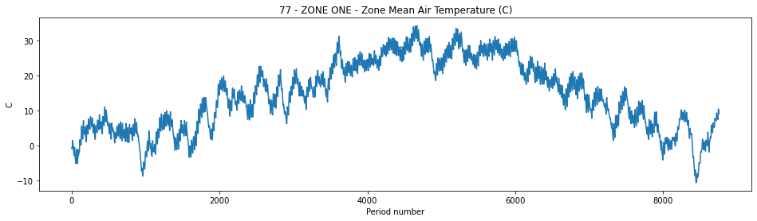

Welcome to eprun's documentation!
=================================

*eprun* is a Python package for running `EnergyPlus <https://energyplus.net/>`_ simulations.

What is *eprun*?
----------------

*eprun* is a Python package which can be used to run EnergyPlus simulations for modelling the energy and environmental performance of buildings. 

*eprun* contains Python functions and classes which can:

* run an EnergyPlus simulation within the Python environment
* view the data in EnergyPlus output files (such as .end, .err and .eso files)
* create and/or modify EnergyPlus input files (such as .idf, .epJSON and .epw files)

Why use *eprun*?
----------------

*eprun* enables EnergyPlus to be used entirely within a Python environment. This can be useful for:

* Using Python statements (such as `for <for>` loops) to run multiple simulations for batch processing or parametric analysis
* Analysing the simulation results using Python data analysis tools such as `pandas <https://pandas.pydata.org/>`_ and `matplotlib <https://matplotlib.org/3.3.3/index.html>`_
* Creating simulation input files from scratch using Python statements
* Modifying simulation input files and weather files directly for setting up multiple simulation runs 
* Collaborating on and version controlling EnergyPlus workflows (for example using `GitHub <https://github.com/>`_)
* Publishing academic papers and reports based on EnergyPlus simulations, with the option to publish the Python code which created the results as part of an Open Science workflow

Quick Demo
----------

*eprun* uses the `eprun` function to run an EnergyPlus simulation. 
The code below runs an EnergyPlus simulation on an EnergyPlus input file (.idf) and an EnergyPlus weather file (.epw).

.. code-block:: python
   :lineno-start: 1

   >>> from eprun import eprun
   >>> epresult=eprun(ep_dir=r'C:\EnergyPlusV9-4-0',
   >>>                input_filepath='1ZoneUncontrolled.idf',
   >>>                epw_filepath='USA_CO_Golden-NREL.724666_TMY3.epw',
   >>>                sim_dir='simulation_files')
   >>> print(type(epresult))
   <class 'eprun.epresult.EPResult'>

We can see that the simulation was successful by looking at the single line '.end' file, 
one of the output files produced by the simulation run.

.. code-block:: python
   :lineno-start: 8

   >>> print(epresult.get_end().line)
   EnergyPlus Completed Successfully-- 0 Warning; 0 Severe Errors; Elapsed Time=00hr 00min  2.39sec

The simulation outputs are located in the '.eso' file, another of the simulation output files. 
We can see a summary of the interval (hourly) results in the 'RUN PERIOD 1' simulation environment section 
of the *eso* file by using the `EPEsoSimulationEnvironment.get_interval_summary` method:

.. code-block:: python
   :lineno-start: 10

   >>> print(epresult.get_eso().get_environment('RUN PERIOD 1').get_interval_summary())
   Starts at 2001-01-01T00:00:00+00:00, 8760 periods @ 60 minute intervals
   7 - Environment - Site Outdoor Air Drybulb Temperature (C)
   47 - ZONE ONE - Zone Total Internal Latent Gain Energy (J)
   74 - ZONE ONE - Zone Mean Radiant Temperature (C)
   75 - ZONE ONE - Zone Mean Air Temperature (C)
   76 - ZONE ONE - Zone Air Heat Balance Surface Convection Rate (W)
   77 - ZONE ONE - Zone Air Heat Balance Air Energy Storage Rate (W)

The `EPEsoIntervalVariable.plot` method can be used to create a quick time series plot of the hourly data.
Here the hourly values for the 'ZONE ONE - Zone Mean Air Temperature' variable are shown.

.. code-block:: python
   :lineno-start: 18

   >>> epresult.get_eso().get_environment('RUN PERIOD 1').get_interval_variable(75).plot()

The next section introduces the *eprun* package and gives more details and examples of how to use the *eprun* methods and classes.

.. :py:meth:`~eprun.epeso_interval_variable.EPEsoIntervalVariable.plot`

.. toctree::
   :maxdepth: 1
   :caption: Start here:
   :hidden:

   Introduction
   Demo - Running an EnergyPlus Simulation
   Demo - Results of a Simulation Run
   Demo - Reading the Output Files
   
.. toctree::
   :maxdepth: 1
   :caption: Tutorials:
   :hidden:
   
   Working with Errors
   Reading the eso Output File
   
   
.. toctree::
   :maxdepth: 1
   :caption: Reference - Simulation Run:
   :hidden:
   
   eprun_function
   EPResult_class

   
.. toctree::
   :maxdepth: 1
   :caption: Reference - Output files:
   :hidden:
   
   EPEnd_class
   EPErr_class
   EPEso_class
   
   
.. toctree::
   :maxdepth: 1
   :caption: Reference - Input files:
   :hidden:
   
   EPInput_class
   EPSchema_class   
   

   

   
   
..
  Indices and tables
  ==================

  * :ref:`genindex`
  * :ref:`modindex`
  * :ref:`search`
